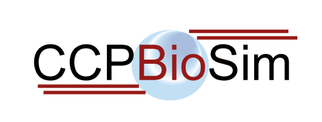

# [CCPBioSim](https://ccpbiosim.ac.uk) Bristol Training Week

Event Dates: From Monday April 9th 2018 to Friday 13th April 2018

## Location

[University of Bristol, Cantock's Close, Bristol, BS8 1TS](https://goo.gl/maps/qF8VTFMuYRC2)

[Room W414, Chemistry Building](room.md)

[(instructions to find the room)](room.md)

## Summary

This CCPBioSim training week is a series of half day training workshops aimed 
at training biomolecular scientists in current methodologies and tools. Each 
course is aimed at a different topic and is [booked individually](http://www.cvent.com/d/9tqvyd). 

## Information

* [Code of conduct](https://ccpbiosim.github.io/workshop/events/bristol2018/conduct.html)
* [Workshop server / how to download and use at home](https://ccpbiosim.github.io/workshop/events/bristol2018/server.html)

You can talk with each other and the trainers using the 
<a href="https://etherpad.net/p/ccpbiosim_bristol18" target="_blank">workshop etherpad</a>. Please
keep discussion respectful and remember the [code of conduct](https://ccpbiosim.github.io/workshop/events/bristol2018/conduct.html).

## Programme

### Monday 9th April - Room W414, Chemistry Building

* 11.00 - 13.00 : [Python for Biomolecular Modellers Part 1](https://ccpbiosim.github.io/python_and_data)
* 13.00 - 14.30 : Lunch
* 14.30 - 17.30 : [Python for Biomolecular Modellers Part 2](https://ccpbiosim.github.io/python_and_data)

### Tuesday 10th April - Room W414, Chemistry Building

* 10.00 - 13.00 : [Setting up and Running Molecular Dynamics Simulations: Good Practice and Pitfalls](https://ccpbiosim.github.io/md_workshop)
* 13.00 - 14.30 : Lunch
* 14.30 - 17.30 : [Tackling Protein alchemistry with FESetup and Sire SOMD](https://ccpbiosim.github.io/fesetup_workshop)

### Wednesday 11th April - Room W414, Chemistry Building

* 10.00 - 13.00 : [Alchemical Free Energy Simulation Analysis with analyse_freenrg](https://ccpbiosim.github.io/fe_analysis)
* 13.00 - 14.30 : Lunch
* 14.30 - 17.30 : [ISAMBARD: A Python-based API for Biomolecular Structure Analysis and Parametric Design of Protein Structures](https://ccpbiosim.github.io/isambard_workshop)

### Thursday 12th April - Room W414, Chemistry Building

* 10.00 - 13.00 : [Introduction to BioSimSpace](https://ccpbiosim.github.io/biosimspace_workshop)
* 13.00 - 14.30 : Lunch
* 14.30 - 17.30 : [Visualising Binding Free Energies Using Swap-based Methods](https://ccpbiosim.github.io/xswaps)

### Friday 13th April - Room W414, Chemistry Building

* 10.00 - 13.00 : [QM/MM Modelling of Enzyme Reactions](https://ccpbiosim.github.io/qmmm_workshop)
* 13.00 - 14.30 : Lunch
* 14.30 - 17.30 : [Calculating Water Affinities in Protein Binding Sites with Grand Canonical Monte Carlo and ProtoMS](https://ccpbiosim.github.io/gcmc_protoms_workshop)
