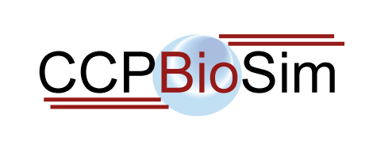

# [CCPBioSim](https://ccpbiosim.ac.uk) Bristol Training Week

Event Dates: From Monday May 20th 2019 to Friday 24th May 2019

## Feedback Survey

Please fill in this [feedback survey](feedback.md) when you complete each
workshop.

## Location

[University of Bristol, Cantock's Close, Bristol, BS8 1TS](https://goo.gl/maps/qF8VTFMuYRC2)

[Room W414, Chemistry Building](room.md)

[(instructions to find the room)](room.md)

## Summary

This CCPBioSim training week is a series of half day training workshops aimed
at training biomolecular scientists in current methodologies and tools. Each
course is aimed at a different topic and is [booked individually](http://www.cvent.com/d/9tqvyd).

## Information

* [Code of conduct](https://ccpbiosim.github.io/workshop/events/bristol2019/conduct.html)
* [Workshop server / how to download and use at home](https://ccpbiosim.github.io/workshop/events/bristol2019/server.html)

You can talk with each other and the trainers using the
<a href="https://etherpad.net/p/ccpbiosim_bristol19" target="_blank">workshop etherpad</a>. Please
keep discussion respectful and remember the [code of conduct](https://ccpbiosim.github.io/workshop/events/bristol2019/conduct.html).

## Programme

### Monday 20th May - Room W414, Chemistry Building

* 11.00 - 13.00 : [Introduction to Python and Jupyter Notebooks](https://ccpbiosim.github.io/python_and_data)
* 13.00 - 14.00 : Lunch
* 14.00 - 17.00 : [Setting up and Running Molecular Dynamics Simulations: Good Practice and Pitfalls](https://ccpbiosim.github.io/md_workshop)

### Tuesday 21st May - Room W414, Chemistry Building

* 10.00 - 13.00 : [Introduction to BioSimSpace](https://ccpbiosim.github.io/biosimspace_workshop)
* 13.00 - 14.00 : Lunch
* 14.00 - 17.00 : [Free Energy Calculations with BioSimSpace]()

### Wednesday 22nd May - Room W414, Chemistry Building

* 10.00 - 13.00 : [Using Remote Resources Part 1: Longbow](https://ccpbiosim.github.io/longbow-workshop)
* 13.00 - 14.00 : Lunch
* 14.00 - 17.00 : [Using Remote Resources Part 2: Crossbow](https://ccpbiosim.github.io/longbow-workshop)

### Thursday 23rd May - Room W414, Chemistry Building

* 10.00 - 11.00 : [Introduction to Markov State Modelling Part 1](https://ccpbiosim.github.io/msm_workshop)
* 11.15 - 12.30 : [Future of Biomolecular Simulation Community Meeting]()
* 13.00 - 14.30 : Lunch
* 14.00 - 17.00 : [Introduction to Markov State Modelling Part 2](https://ccpbiosim.github.io/msm_workshop)

### Friday 24th May - Room W414, Chemistry Building

* 10.00 - 13.00 : [Advanced Simulation Methods: QM/MM](https://ccpbiosim.github.io/qmmm_workshop)
